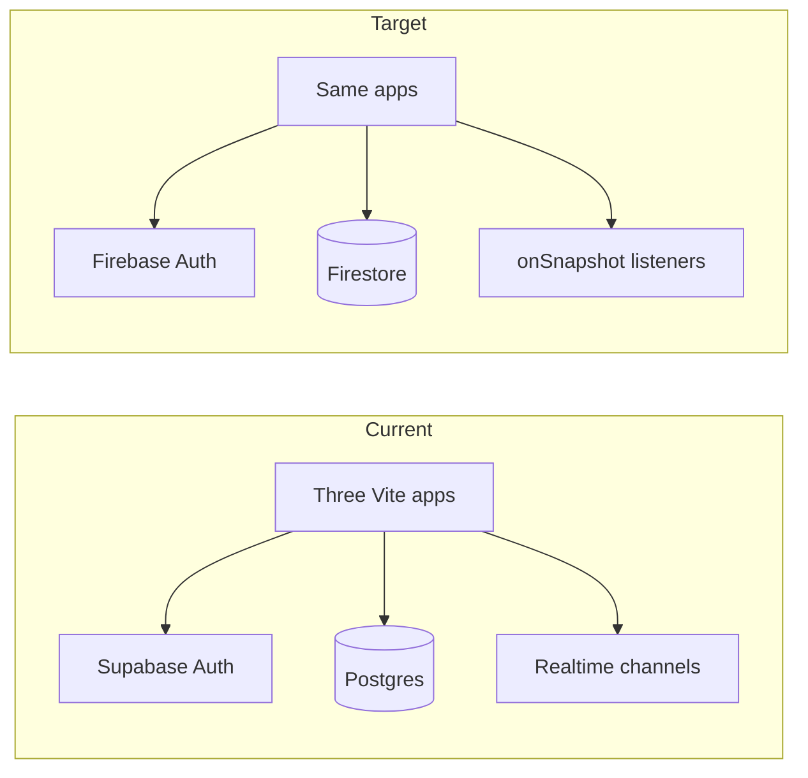

# Performance improvements and Firebase migration

## Current state (from codebase review)

- **Apps**: [patient-website](patient-website/), [doctor-dashboard](doctor-dashboard/), [admin-dashboard](admin-dashboard/) — React 19, Vite 7, Tailwind, TanStack Query, React Router v7 ([README](README.md)).
- **Backend today**: **Supabase** — `@supabase/supabase-js` in each app’s [supabaseClient.js](patient-website/src/services/supabaseClient.js); env vars `VITE_SUPABASE_URL` / `VITE_SUPABASE_ANON_KEY`.
- **Data access pattern**: Direct `.from('...')` queries across many tables, plus **Realtime** via `supabase.channel(...).subscribe()` (e.g. triage, messages, appointments, doctors, patients). No `storage.*` usage found in the repo (profile URLs appear to be string fields, not Supabase Storage in code).
- **Images (major lever, not the only one)**:
  - Large static files under `public/` (e.g. `homePicture.png` ~2.6MB, `contactBanner.jpg` ~2.1MB, hero `landingPicture.jpg` ~1.1MB, many gallery PNGs 200KB–800KB+). Folder [patient-website/public/assets/images](patient-website/public/assets/images) is on the order of **~20MB** total.
  - [Gallery.jsx](patient-website/src/pages/Gallery.jsx) renders **12 full-size images at once** with plain `` — no lazy loading, no responsive variants.
  - [HomeHero.jsx](patient-website/src/components/hero/HomeHero.jsx) uses a **full-bleed CSS `background-image`** for LCP — typically loads the entire JPEG with no `srcset`, no modern format, no priority hints.
- **Bundling / runtime**: [App.jsx](patient-website/src/App.jsx) (and doctor/admin equivalents) use **static imports for all routes** — no route-level **code splitting**; [main.jsx](patient-website/src/main.jsx) pulls Swiper CSS globally; [index.html](patient-website/index.html) loads **many legacy CSS files** (Bootstrap, Font Awesome, theme CSS) on every page — likely redundant with Tailwind and worth auditing.
- **React Query**: `new QueryClient()` with defaults — tuning must be split by **data source** (see Part A6) so it does not fight Realtime/listeners today or Firestore listeners after migration.

---

## Non-functional requirements — definition of done

Without locked metrics, tuning does not stop and milestones cannot be proven. Agree these **before** Part A work ships and **re-baseline after** major changes.

**Performance (example targets — calibrate to product; document actual numbers in repo)**

- **LCP**: Track **p75** (and optionally p90) on agreed **URL + connection profile** (e.g. Home and Gallery on Slow 4G or equivalent throttling). Example goal: LCP p75 under a team-agreed threshold after image + LCP fixes (record baseline first).
- **CLS**: Explicit **CLS budget** (e.g. ≤ 0.1 on key templates) with a short **checklist**: reserved space for images/embeds, skeleton loaders where content is async, font strategy to limit swap shift.
- **INP / interactivity**: Image work may **not** move INP much. Separate track: **long tasks** on dashboards (heavy JS, maps, PDF, charts), **third-party scripts**, and main-thread work. Set a TBT or INP-related goal only after baseline on **dashboard routes**, not only marketing pages.
- **Bundle**: After **rollup-plugin-visualizer** (or equivalent), set **per-app chunk budget targets** (gzip/brotli); optional CI failure on regression beyond a threshold.

**Measurement protocol**

- **Baseline first**: Same device matrix (or lab profiles), same build, same env — store Lighthouse / Web Vitals exports or CI artifacts.
- **Regression control**: **Lighthouse CI** (or similar) on PRs for 1–2 critical URLs per app; optional bundle-size check tied to visualizer output.
- **Stop rule**: If a change does not move agreed metrics, revert or iterate — avoids endless manualChunks tuning without evidence.

**Decouple asset delivery from DB migration**

- Ship **optimized static assets** on the **current host** (and existing CDN/cache headers if any) first. Treat **Firebase Hosting** (or another CDN) as a **separate optional phase** triggered by global latency, cache strategy, or ops preference — **not** a dependency for Part A image wins.

---

## Part A — Front-end performance (all three apps)

**Priority: bytes and LCP first, then interactivity (fonts, third-parties, long tasks), then bundle splitting with evidence.**

### A1 — Images (highest byte impact on marketing pages)

- Re-encode and resize: **WebP** (+ optional **AVIF**) at **display-appropriate** dimensions; **gallery thumbs** vs **modal full** assets.
- Heuristic **200–300KB** for hero/above-the-fold is a guide; **success is the agreed LCP/CLS metrics**, not a single file size.
- Markup: `loading="lazy"` / `decoding="async"` below the fold; **no** lazy on LCP candidate; **`fetchPriority="high"`** only on that candidate; **`srcset` + `sizes`** for hero and wide banners; prefer **foreground ``** or **`<picture>`** over CSS-only huge `background-image` for LCP, or **preload** the single critical URL with dimensions/aspect-ratio to control CLS.

### A2 — CLS beyond images

- Dynamic lists and dashboards: **reserve height** or use skeletons so layout does not jump when data arrives.
- Embed-heavy routes: explicit containers for maps, chat, video (if present).

### A3 — Fonts and icons

- Audit payload from **Bootstrap / Font Awesome / theme CSS + Tailwind**: often duplicate **fonts and icon** cost plus **FOIT/FOUT**.
- Adopt an explicit **font strategy**: `font-display`, subsetting, **self-hosted** vs CDN, and remove unused icon sets where possible.

### A4 — Third-party scripts

- Inventory **analytics, maps (e.g. Leaflet), video, chat widgets, barcode, PDF** — these often dominate **TBT/INP** on inner pages more than static images. Lazy-load or route-gate where feasible; measure before/after in baseline protocol.

### A5 — Route code splitting

- **`React.lazy` + `Suspense`** for route trees in each app’s router ([patient-website/src/App.jsx](patient-website/src/App.jsx), doctor/admin `App.jsx`).

### A6 — CSS and global imports

- Audit [patient-website/index.html](patient-website/index.html): cut render-blocking CSS not needed on first paint; align **Tailwind-first** where possible.
- Load Swiper CSS **only** where Swiper is used.

### A7 — TanStack Query — split policies (do not tune blindly)

- **Listener-driven UI** (Realtime today; Firestore `onSnapshot` tomorrow): queries should **not** fight subscriptions — avoid aggressive refetch for the same data the listener updates. Tune **per hook/domain**.
- **Reference / infrequent data**: longer `staleTime` / appropriate `gcTime` where listeners are not used.
- **Sequencing**: Finalize **default `QueryClient` policy after** realtime/listener strategy is stable per app, or maintain **two explicit policies** documented in code comments. Optionally defer broad Query tuning until post-migration if it risks masking stale UI during the strangler period.

### A8 — Vite / chunks

- **Require** `rollup-plugin-visualizer` (or equivalent) **before** optional **`manualChunks`** — acceptance criteria: improved cache behavior or smaller critical path, not worse cache splitting.
- Production: ensure **compression** at CDN/host (**Brotli** where supported).

### A9 — Verification

- Re-run **measurement protocol**; compare **baseline vs post**; document deltas in PR or runbook.

---

## Part B — Migrate data and auth to Firebase

**Default stack**: **Cloud Firestore + Firebase Auth + `onSnapshot`** replacing Postgres + Supabase Auth + channels. **Realtime Database** only if a feature truly fits a shallow tree and team accepts tradeoffs. **Cloud SQL (Postgres)** preserves SQL but is **not** “Firestore”; use only if product mandates SQL — pair with Firebase Auth if desired.

This is **not** “lift tables and attach listeners.” It is a **query-and-access-pattern migration**: every screen that relies on **joins, filters, sorts, counts, and aggregates** needs a **Firestore-shaped answer** (denormalization, duplicate writes on write path, **collection group** queries, **composite indexes**, **Cloud Functions** for heavy aggregations, etc.). **“Plan indexes early” is necessary, not sufficient.**

### B0 — Phase 0 decisions (lock before large implementation)

Record in a short **ADR** (or equivalent):

1. **Document ID strategy**: Firebase Auth **UID as primary user key** vs stable **`legacy_id`** on documents — this drives **Firestore paths, security rules, and client cache keys**. Pick one approach for all new writes; migration scripts must be consistent.
2. **Cutover model** (force an explicit choice — do not default into dual-write by accident):
   - **Maintenance window + single cutover**: simpler correctness; all users accept downtime or read-only window; **preferred for healthcare-adjacent data** where merge ordering bugs are unacceptable.
   - **Dual-system** (dual-write / read-new): only with **idempotency**, **ordering rules**, **conflict resolution**, and **tested reconciliation** — major engineering cost; justify only with hard zero-downtime requirements.
3. **Auth migration**: Password hash portability vs **forced reset** window — **legal/compliance** sign-off. Also decide: **session continuity** (expect **full re-login** at cutover unless you implement token bridge — usually not), **OAuth provider mapping** (Google, Apple, etc.), **email verification** state, and **MFA** roadmap if applicable later.

### B1 — Query-by-query inventory (“one-pager” per major feature)

For each major feature (bookings, messaging, triage, records, admin lists, routes/places, calls):

- List **today’s Supabase queries**: joins, `where`, `order`, `limit`, counts, aggregates.
- For each, document the **Firestore strategy**: denormalized fields, subcollections, collection groups, indexes to create, **Callable Functions** for server-side aggregation, pagination cursors.
- Output: a **query map** linked to **screens** — this is the execution checklist for Part B.

### B2 — Data model and ETL

- Design **collections/subcollections** from the query map, not only from Postgres table names.
- **ETL**: export → transform → **batched writes** (500-op limit), index creation order, idempotent reruns where possible.
- **Transactions / multi-doc updates** where Postgres used transactional semantics (e.g. booking + slot).

### B3 — Realtime

- Replace `supabase.channel` with **`onSnapshot`** with **narrow queries**; verify **unsubscribe** on unmount; monitor for **listener leaks** (read spikes).

### B4 — Security and compliance

- **Firestore rules** + **custom claims** for roles — rulesets can become large and error-prone.
- **Rules testing**: **Firebase Emulator** + automated **rules unit tests**; **staging rules parity** with prod before cutover.
- If the product handles **health or sensitive data**: explicit pass on **regulatory/compliance** expectations (e.g. **BAA** where applicable, **audit logging**, **data residency**, **encryption** expectations). “Migrate to Firebase” is a **compliance** project as well as a technical one — engage stakeholders early.

### B5 — Operations: backup, rollback, observability

- **RPO/RTO**: How much data can you lose / how fast must restore be? **Supabase backup**: retention, who verifies restore drills, how long read-only replica stays.
- **Monitoring**: Firestore **usage and quota alerts**, **Auth error rates**, anomalous **read/write** patterns (listener issues).
- **Cutover**: **Feature flags** or **canary** where possible; **runbook** with **instant rollback** (revert app config to Supabase read-only, DNS, env vars) if rules or indexes are wrong in prod.
- **Decommission Supabase** only after signed-off criteria (see Testing).

### B6 — Testing strategy (non-negotiable before decommission)

- **Service layer contract tests** (new `services/db/*` vs old behavior on fixtures).
- **E2E** on critical flows: **book**, **message**, **triage**, **login/role access**, **admin patient/doctor** as applicable.
- **Firestore rules tests** (emulator).
- Optional: **soak** or **load** on listener-heavy dashboards.

---

## Suggested execution order (revised)

1. **NFR baseline + CI hooks** (so every subsequent PR proves value).
2. **Image + LCP + CLS + fonts + third-party inventory** on highest-traffic templates (patient site first; then dashboards for INP/TBT).
3. **Route lazy loading** + **bundle visualizer**; **manualChunks** only with acceptance criteria.
4. **Phase B0 ADR** (IDs, cutover model, auth).
5. **Query map + Firestore model + indexes + rules + emulator tests**.
6. **Service layer + ETL + strangler** (or single cutover per B0).
7. **Ops runbook, monitoring, canary/rollback**, then **Supabase decommission** after test sign-off.

---

## Migration runbook (outline — expand at execution time)

- **Pre**: Baseline metrics; freeze schema changes or track them; backup verified.
- **Order**: Auth strategy executed per ADR → data migration → app config switch → smoke tests → monitor 24–72h.
- **Rollback**: Env + DNS + feature flags; criteria for invoking rollback; comms template.
- **Post**: Decommission checklist; cost review; retrospective.
